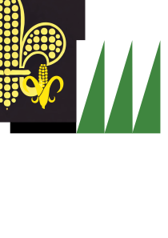

### "Prairie State Flag"

The fleur-de-lis shape with the center petal as an ear of corn represents Illinois' position as an agricultural powerhouse between the Mississippi and Wabash / Ohio rivers. Twenty-one kernels represent Illinois' entry as the 21st state. A black field stands for Illinois' fertile soil, coal and oil resources and the steel of our railroads and factories. The white background relates this flag to the old Illinois flag. Three green blades of prairie grass represent the three state capital cities.

